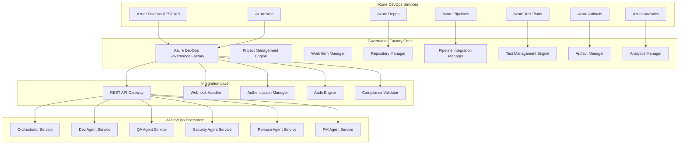

# Azure DevOps Governance Factory - Service Overview

## 1. Executive Summary

### 1.1 Service Vision

The **Azure DevOps Governance Factory** serves as the foundational integration layer and enterprise governance engine within the AI DevOps ecosystem. This service provides seamless integration with the Microsoft Azure DevOps platform, enabling comprehensive project lifecycle management, enterprise-grade governance, and automated compliance validation across all development activities.

**Core Mission Statement**: Transform Azure DevOps from a project management tool into an intelligent, enterprise-governed development platform that automatically enforces CMMI processes, maintains complete audit trails, and provides real-time business intelligence across all software development activities.

### 1.2 Strategic Positioning

**Market Position**: Industry-leading Azure DevOps integration platform that bridges the gap between Microsoft's enterprise tooling capabilities and modern AI-powered development workflows.

**Competitive Advantage**:
- **Deep Azure Ecosystem Integration**: Native integration with all Azure DevOps services including Repos, Pipelines, Test Plans, Artifacts, and Analytics
- **Enterprise Governance Automation**: Automated CMMI compliance, audit trail generation, and regulatory reporting
- **Intelligent Process Orchestration**: AI-powered workflow automation with human-in-the-loop oversight
- **Comprehensive API Coverage**: Full REST API integration for all Azure DevOps operations with enterprise security
- **Multi-Tenant Architecture**: Support for multiple organizations and projects with centralized governance

### 1.3 Business Value Framework

**Primary Value Propositions**:

1. **🏗️ Enterprise Platform Foundation**: Comprehensive Azure DevOps integration providing enterprise-grade project management and development platform capabilities

2. **📋 Governance Automation**: Automated CMMI process enforcement, compliance validation, and audit trail generation for enterprise governance requirements

3. **🔗 Seamless Integration**: Native integration with Azure Repos, Pipelines, Test Plans, Artifacts, and Analytics providing unified development experience

4. **📊 Business Intelligence**: Real-time analytics, predictive insights, and executive dashboards providing strategic visibility into development activities

5. **🛡️ Security and Compliance**: Enterprise security controls, multi-tenant isolation, and regulatory compliance automation (SOX, GDPR, HIPAA)

**Financial Impact**:
- **Development Investment**: $1.2M over 12 months
- **Expected 3-Year ROI**: 545%
- **Annual Cost Savings**: $2.8M (process automation, compliance efficiency, platform optimization)
- **Revenue Enhancement**: $1.5M annually (faster delivery, improved quality, competitive differentiation)

### 1.4 Service Architecture Overview

**Core Platform Components**:

### 1.5 Key Capabilities and Features

#### 1.5.1 Project Lifecycle Management

**Project Bootstrap and Configuration**:
- Automated Azure DevOps project creation with enterprise templates
- Process template selection and configuration (CMMI, Agile, Scrum, Custom)
- Team structure setup with role-based permissions and access controls
- Repository initialization with branch policies and security controls
- Pipeline template deployment with enterprise CI/CD patterns

**Work Item Management**:
- Complete work item CRUD operations with CMMI hierarchy validation
- Epic → Feature → Requirement → Task traceability enforcement
- Automated work item linking and dependency management
- Business value tracking and ROI calculation across work items
- Cross-project work item coordination and portfolio management

#### 1.5.2 Repository and Source Control Integration

**Azure Repos Management**:
- Repository creation and configuration with enterprise standards
- Branch policy enforcement with automated code review requirements
- Pull request automation with rich metadata and compliance validation
- Code quality gates with automated security and compliance scanning
- Merge conflict resolution with intelligent automation

**Version Control Operations**:
- Automated branching strategies (GitFlow, GitHub Flow, custom patterns)
- Tag management for release versioning and milestone tracking
- Commit message standardization with work item linking validation
- Code review automation with AI-powered quality assessment
- Repository analytics and performance optimization

#### 1.5.3 CI/CD Pipeline Integration

**Azure Pipelines Orchestration**:
- Pipeline template management with enterprise best practices
- Multi-stage pipeline configuration (Build, Test, Security, Deploy)
- Environment promotion with automated approval workflows
- Release gate integration with quality and security validation
- Infrastructure as Code (IaC) pipeline integration

**Build and Deployment Automation**:
- Automated build artifact generation and versioning
- Container image building and Azure Container Registry integration
- Multi-environment deployment with blue-green and canary strategies
- Rollback automation with disaster recovery procedures
- Performance monitoring integration with Application Insights

#### 1.5.4 Quality Assurance and Testing Integration

**Azure Test Plans Integration**:
- Test case management with automated test suite generation
- Test execution coordination with CI/CD pipeline integration
- Test result analysis and quality metrics reporting
- Regression testing automation with intelligent test selection
- Performance testing integration with Azure Load Testing

**Quality Metrics and Reporting**:
- Code coverage analysis and trend tracking
- Bug detection and severity classification with automated triage
- Quality gate validation with blocking criteria for deployment
- Test automation metrics and effectiveness analysis
- Quality dashboard with executive reporting capabilities

#### 1.5.5 Artifact and Package Management

**Azure Artifacts Integration**:
- Package management with automated versioning and promotion
- Dependency management with security vulnerability scanning
- Artifact publication with automated quality validation
- Feed management with enterprise security and access controls
- License compliance tracking and validation

**Build Artifact Coordination**:
- Build artifact storage and lifecycle management
- Cross-project artifact sharing with proper access controls
- Artifact promotion between environments with approval workflows
- Retention policy enforcement with archival automation
- Artifact security scanning and compliance validation

### 1.6 Integration Architecture

#### 1.6.1 Azure DevOps REST API Integration

**Comprehensive API Coverage**:
- **Core Services**: Projects, Teams, Security, Graph API
- **Work Management**: Work Items, Queries, Boards, Backlogs
- **Code Management**: Git Repositories, Pull Requests, Policies
- **Build & Release**: Pipelines, Builds, Releases, Environments
- **Test Management**: Test Plans, Suites, Cases, Results
- **Artifact Management**: Feeds, Packages, Artifacts
- **Analytics**: Analytics, Reporting, Dashboards

**Enterprise Integration Patterns**:
- Multi-tier authentication with Personal Access Tokens (PAT) and Service Principals
- Rate limiting and throttling with intelligent retry mechanisms
- Bulk operations optimization with batch processing capabilities
- Real-time synchronization with webhook integration
- Error handling with circuit breaker patterns and graceful degradation

#### 1.6.2 AI DevOps Ecosystem Integration

**Orchestrator Service Coordination**:
- Project bootstrap requests with template selection and configuration
- Work item state synchronization with automated routing to agent services
- Cross-service dependency management with conflict resolution
- Human-in-the-loop escalation for complex scenarios requiring manual intervention

**Agent Service Integration**:
- **Dev Agent**: Repository operations, code generation, documentation automation
- **QA Agent**: Test case management, automated testing, quality metrics
- **Security Agent**: Security scanning, compliance validation, vulnerability management
- **Release Agent**: Deployment automation, environment promotion, release coordination
- **PM Agent**: Requirements analysis, sprint planning, stakeholder communication

### 1.7 Enterprise Governance and Compliance

#### 1.7.1 CMMI Process Compliance

**Process Template Enforcement**:
- CMMI Level 3+ process template validation and enforcement
- Work item hierarchy validation (Epic → Feature → Requirement → Task)
- Traceability matrix maintenance with complete audit trails
- Process improvement through data-driven insights and recommendations

**Quality Assurance Integration**:
- Quality gate enforcement at all development stages
- Peer review requirements with automated validation
- Testing coverage requirements with blocking deployment criteria
- Documentation requirements with automated generation and validation

#### 1.7.2 Security and Access Control

**Enterprise Security Framework**:
- Azure Active Directory integration with single sign-on (SSO)
- Role-based access control (RBAC) with fine-grained permissions
- Multi-factor authentication (MFA) enforcement for sensitive operations
- API key management with Azure Key Vault integration

**Data Protection and Privacy**:
- Data encryption at rest and in transit with enterprise-grade protocols
- Personal data protection with GDPR compliance automation
- Audit trail encryption with tamper-evident logging
- Data retention policies with automated archival and deletion

#### 1.7.3 Regulatory Compliance Automation

**Compliance Framework Support**:
- **SOX Compliance**: Financial reporting controls and audit trail validation
- **GDPR Compliance**: Personal data protection and privacy rights automation
- **HIPAA Compliance**: Healthcare data protection and access controls
- **ISO 27001**: Information security management system requirements

**Automated Reporting**:
- Regulatory compliance reports with scheduled generation and distribution
- Audit trail reports with complete activity tracking and validation
- Security compliance dashboards with real-time monitoring
- Executive compliance summaries with KPI tracking and trend analysis

### 1.8 Business Intelligence and Analytics

#### 1.8.1 Real-Time Analytics Platform

**Executive Dashboards**:
- Portfolio health monitoring with strategic KPIs and business value tracking
- Project performance analytics with predictive insights and recommendations
- Resource utilization optimization with capacity planning and forecasting
- Business value delivery tracking with ROI calculation and trend analysis

**Operational Analytics**:
- Development velocity tracking with team performance optimization
- Quality metrics analysis with defect prediction and prevention
- Deployment frequency and success rate monitoring with failure analysis
- Security incident tracking with threat analysis and response coordination

#### 1.8.2 Predictive Intelligence

**AI-Powered Insights**:
- Project success probability prediction with risk factor analysis
- Resource demand forecasting with skill gap identification
- Quality risk assessment with automated prevention recommendations
- Security threat prediction with proactive mitigation strategies

**Business Value Optimization**:
- Feature value prediction with business impact assessment
- Technical debt analysis with remediation prioritization
- Performance optimization recommendations with cost-benefit analysis
- Strategic planning support with data-driven decision making

### 1.9 Performance and Scalability

#### 1.9.1 Enterprise-Scale Architecture

**Scalability Design**:
- Microservice architecture with independent scaling capabilities
- Container orchestration with Kubernetes and Azure Container Service
- Load balancing with Azure Load Balancer and Application Gateway
- Auto-scaling with demand-based resource allocation

**Performance Optimization**:
- Caching strategies with Redis and Azure Cache for Redis
- Database optimization with Azure SQL and Cosmos DB
- CDN integration with Azure CDN for global content delivery
- Connection pooling and resource optimization for high throughput

#### 1.9.2 Reliability and Availability

**High Availability Design**:
- Multi-region deployment with automatic failover capabilities
- Data replication with geo-redundant storage and backup
- Disaster recovery with automated recovery procedures
- Health monitoring with proactive alerting and automated remediation

**Service Level Objectives**:
- **Availability**: 99.9% uptime with planned maintenance windows
- **Performance**: <2 second response time for 95% of API calls
- **Scalability**: Support for 10,000+ concurrent users
- **Data Durability**: 99.999999999% (11 9's) data durability

### 1.10 Implementation Roadmap

#### 1.10.1 Phase 1: Foundation (Months 1-3)

**Core Platform Development**:
- Azure DevOps REST API integration layer with comprehensive coverage
- Project management engine with bootstrap and lifecycle capabilities
- Work item management with CMMI compliance validation
- Authentication and authorization framework with enterprise security

**Deliverables**:
- Core API gateway with Azure DevOps integration
- Project bootstrap service with template management
- Work item CRUD operations with hierarchy validation
- Security framework with Azure AD integration

#### 1.10.2 Phase 2: Integration (Months 4-6)

**Repository and Pipeline Integration**:
- Azure Repos integration with branch management and pull request automation
- Azure Pipelines integration with CI/CD orchestration
- Azure Test Plans integration with quality management
- Azure Artifacts integration with package management

**Deliverables**:
- Complete repository management capabilities
- CI/CD pipeline orchestration and automation
- Test management and quality assurance integration
- Artifact management with security scanning

#### 1.10.3 Phase 3: Governance (Months 7-9)

**Enterprise Governance Implementation**:
- CMMI process enforcement with automated validation
- Compliance framework with regulatory reporting
- Audit trail generation with tamper-evident logging
- Business intelligence dashboard with executive reporting

**Deliverables**:
- CMMI compliance automation and validation
- Regulatory compliance reporting and monitoring
- Comprehensive audit trail and forensic capabilities
- Executive dashboards with business intelligence

#### 1.10.4 Phase 4: Optimization (Months 10-12)

**Performance and Intelligence Enhancement**:
- AI-powered analytics with predictive insights
- Performance optimization with auto-scaling
- Advanced security with threat detection
- Continuous improvement with feedback integration

**Deliverables**:
- Predictive analytics with AI-powered insights
- Performance optimization and auto-scaling
- Advanced security with threat detection
- Continuous improvement framework

### 1.11 Success Metrics and KPIs

#### 1.11.1 Technical Performance Indicators

**Platform Performance**:
- **API Response Time**: <2 seconds for 95% of requests
- **System Availability**: 99.9% uptime with monitoring validation
- **Scalability**: Support 10,000+ concurrent operations
- **Integration Success**: 100% successful Azure DevOps API operations

**Quality Metrics**:
- **Code Coverage**: 95%+ across all service components
- **Security Vulnerabilities**: 0 critical, <5 high severity
- **CMMI Compliance**: 100% process adherence validation
- **Error Rate**: <0.1% for critical business operations

#### 1.11.2 Business Value Indicators

**Operational Efficiency**:
- **Project Setup Time**: 95% reduction (from hours to minutes)
- **Compliance Overhead**: 80% reduction through automation
- **Manual Process Elimination**: 90% of routine tasks automated
- **Developer Productivity**: 60% improvement in development velocity

**Strategic Business Impact**:
- **ROI Achievement**: 545% return on investment over 3 years
- **Cost Savings**: $2.8M annually through process optimization
- **Revenue Enhancement**: $1.5M annually through faster delivery
- **Competitive Advantage**: Industry-leading development platform capabilities

#### 1.11.3 User Satisfaction Metrics

**Stakeholder Satisfaction**:
- **Developer Experience**: 4.7/5.0 satisfaction rating
- **Executive Visibility**: 95% satisfaction with business intelligence
- **Compliance Team**: 98% satisfaction with automated reporting
- **Platform Adoption**: 95% user adoption within 6 months

**Continuous Improvement**:
- **Feature Request Fulfillment**: 85% within 3 months
- **Issue Resolution Time**: <24 hours for critical issues
- **User Training Effectiveness**: 95% certification completion
- **Community Engagement**: Active user community with knowledge sharing

---

**Document Version**: 1.0  
**Last Updated**: September 3, 2025  
**Status**: Draft  
**Owner**: Platform Architecture Team  
**Reviewers**: Enterprise Architecture, Azure DevOps SMEs, Business Stakeholders  
**Next Review**: September 15, 2025
