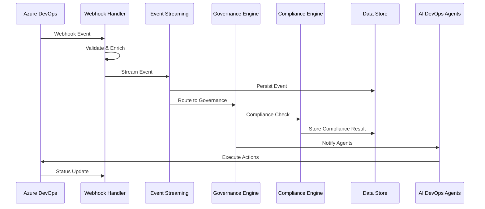

# Azure DevOps Governance Factory - System Architecture

## 1. Architecture Overview

### 1.1 Service Architecture Philosophy

The Azure DevOps Governance Factory follows a **cloud-native, microservice architecture** designed specifically for enterprise-scale Azure DevOps integration and governance automation. The architecture emphasizes **API-first design**, **event-driven communication**, and **comprehensive security** while maintaining **high availability** and **horizontal scalability**.

**Core Architectural Principles**:

1. **Azure-Native Integration**: Deep integration with Azure DevOps REST APIs and Azure ecosystem services
2. **Enterprise Security**: Zero-trust security model with Azure AD integration and comprehensive audit trails
3. **Event-Driven Architecture**: Real-time processing using Azure DevOps webhooks and message queuing
4. **Microservice Design**: Independently deployable services with clear boundaries and responsibilities
5. **API-First Approach**: RESTful APIs for all service interactions with comprehensive documentation
6. **Cloud-Native Scalability**: Containerized services with Kubernetes orchestration and auto-scaling

### 1.2 High-Level System Architecture

```mermaid
graph TB
    subgraph "Azure DevOps Platform"
        ADO[Azure DevOps Organization]
        AR[Azure Repos]
        AP[Azure Pipelines]
        AW[Azure Wiki]
        AT[Azure Test Plans]
        AA[Azure Artifacts]
        ANALYTICS[Azure Analytics]
    end
    
    subgraph "Azure DevOps Governance Factory"
        subgraph "API Gateway Layer"
            APIGW[API Gateway]
            AUTH[Authentication Service]
            RATE[Rate Limiting]
            AUDIT[Audit Logger]
        end
        
        subgraph "Core Services"
            PM[Project Manager]
            WIM[Work Item Manager]
            RM[Repository Manager]
            PIM[Pipeline Manager]
            TM[Test Manager]
            AM[Artifact Manager]
            ANM[Analytics Manager]
        end
        
        subgraph "Governance Services"
            GE[Governance Engine]
            CE[Compliance Engine]
            PE[Policy Engine]
            RE[Reporting Engine]
        end
        
        subgraph "Integration Services"
            WH[Webhook Handler]
            ES[Event Streaming]
            NS[Notification Service]
            SS[Sync Service]
        end
    end
    
    subgraph "AI DevOps Ecosystem"
        ORCH[Orchestrator Service]
        DEV[Dev Agent Service]
        QA[QA Agent Service]
        SEC[Security Agent Service]
        REL[Release Agent Service]
        PMA[PM Agent Service]
    end
    
    subgraph "Azure Platform Services"
        AKS[Azure Kubernetes Service]
        ACR[Azure Container Registry]
        AKV[Azure Key Vault]
        AAD[Azure Active Directory]
        REDIS[Azure Cache for Redis]
        COSMOS[Azure Cosmos DB]
        INSIGHTS[Application Insights]
    end
    
    ADO --> APIGW
    AR --> RM
    AP --> PIM
    AW --> PM
    AT --> TM
    AA --> AM
    ANALYTICS --> ANM
    
    APIGW --> AUTH
    APIGW --> RATE
    APIGW --> AUDIT
    
    AUTH --> PM
    AUTH --> WIM
    AUTH --> RM
    AUTH --> PIM
    AUTH --> TM
    AUTH --> AM
    AUTH --> ANM
    
    PM --> GE
    WIM --> GE
    RM --> GE
    PIM --> GE
    TM --> GE
    AM --> GE
    ANM --> GE
    
    GE --> CE
    GE --> PE
    GE --> RE
    
    ADO --> WH
    WH --> ES
    ES --> NS
    ES --> SS
    
    APIGW --> ORCH
    APIGW --> DEV
    APIGW --> QA
    APIGW --> SEC
    APIGW --> REL
    APIGW --> PMA
    
    PM --> AKS
    WIM --> AKS
    RM --> AKS
    PIM --> AKS
    TM --> AKS
    AM --> AKS
    ANM --> AKS
    GE --> AKS
    CE --> AKS
    PE --> AKS
    RE --> AKS
    WH --> AKS
    ES --> AKS
    NS --> AKS
    SS --> AKS
    
    AUTH --> AAD
    AUTH --> AKV
    AUDIT --> COSMOS
    ES --> REDIS
    PM --> INSIGHTS
    WIM --> INSIGHTS
```



### 1.3 Service Layer Architecture

**Layer 1: API Gateway and Security**
- **API Gateway**: Centralized entry point with routing, rate limiting, and security enforcement
- **Authentication Service**: Azure AD integration with OAuth 2.0 and JWT token management
- **Rate Limiting**: Intelligent rate limiting with quota management and throttling
- **Audit Logger**: Comprehensive audit trail generation with immutable storage

**Layer 2: Core Azure DevOps Integration Services**
- **Project Manager**: Azure DevOps project lifecycle management and configuration
- **Work Item Manager**: Complete work item operations with CMMI hierarchy validation
- **Repository Manager**: Azure Repos integration with branch management and pull request automation
- **Pipeline Manager**: Azure Pipelines orchestration with CI/CD workflow management
- **Test Manager**: Azure Test Plans integration with automated test management
- **Artifact Manager**: Azure Artifacts integration with package and artifact lifecycle management
- **Analytics Manager**: Azure Analytics integration with business intelligence and reporting

**Layer 3: Governance and Compliance Services**
- **Governance Engine**: Enterprise governance orchestration with policy enforcement
- **Compliance Engine**: Regulatory compliance automation with CMMI, SOX, GDPR, HIPAA validation
- **Policy Engine**: Policy definition, enforcement, and exception management
- **Reporting Engine**: Automated reporting with compliance, governance, and business intelligence

**Layer 4: Integration and Event Processing**
- **Webhook Handler**: Azure DevOps webhook processing with intelligent routing
- **Event Streaming**: Real-time event processing with message queuing and persistence
- **Notification Service**: Multi-channel notification management with personalization
- **Sync Service**: Data synchronization with conflict resolution and consistency management

## 2. Service Architecture Details

### 2.1 API Gateway Layer

#### 2.1.1 API Gateway Service

**Service Responsibilities**:
- Centralized API routing and load balancing across all Azure DevOps integration services
- Request/response transformation and protocol translation for Azure DevOps API compatibility
- Service discovery and health monitoring with automatic failover capabilities
- API versioning and backward compatibility management for enterprise integration

**Technical Implementation**:
```python
# API Gateway Configuration
class APIGateway:
    def __init__(self):
        self.azure_devops_client = AzureDevOpsClient()
        self.rate_limiter = RateLimiter()
        self.auth_service = AuthenticationService()
        self.audit_logger = AuditLogger()
    
    async def route_request(self, request: APIRequest) -> APIResponse:
        # Authentication and authorization
        auth_result = await self.auth_service.validate_request(request)
        if not auth_result.is_valid:
            return APIResponse(status=401, error="Unauthorized")
        
        # Rate limiting
        rate_limit_result = await self.rate_limiter.check_limits(request)
        if rate_limit_result.is_exceeded:
            return APIResponse(status=429, error="Rate limit exceeded")
        
        # Route to appropriate service
        service_response = await self.route_to_service(request)
        
        # Audit logging
        await self.audit_logger.log_request(request, service_response)
        
        return service_response
```

**Key Features**:
- **Intelligent Routing**: Dynamic routing based on request content and service health
- **Load Balancing**: Advanced load balancing with health checks and automatic failover
- **Protocol Translation**: HTTP/HTTPS to Azure DevOps REST API protocol translation
- **Monitoring Integration**: Application Insights integration with comprehensive telemetry

#### 2.1.2 Authentication Service

**Service Responsibilities**:
- Azure Active Directory integration with single sign-on (SSO) and multi-factor authentication (MFA)
- OAuth 2.0 and JWT token management with automatic refresh and rotation
- Role-based access control (RBAC) with fine-grained permissions for Azure DevOps operations
- Service principal management for service-to-service authentication

**Authentication Architecture**:
```python
class AuthenticationService:
    def __init__(self):
        self.aad_client = AzureADClient()
        self.token_manager = TokenManager()
        self.rbac_engine = RBACEngine()
        self.key_vault = KeyVaultClient()
    
    async def authenticate_user(self, credentials: UserCredentials) -> AuthResult:
        # Azure AD authentication
        aad_result = await self.aad_client.authenticate(credentials)
        if not aad_result.success:
            return AuthResult(success=False, error="Authentication failed")
        
        # Generate JWT token with Azure DevOps scopes
        token = await self.token_manager.generate_token(
            user_id=aad_result.user_id,
            scopes=self.get_azure_devops_scopes(aad_result.user)
        )
        
        return AuthResult(success=True, token=token, user=aad_result.user)
    
    async def validate_service_principal(self, client_id: str, client_secret: str) -> AuthResult:
        # Service principal validation with Azure AD
        sp_result = await self.aad_client.validate_service_principal(client_id, client_secret)
        
        # Generate service token with appropriate scopes
        service_token = await self.token_manager.generate_service_token(
            service_id=client_id,
            scopes=self.get_service_scopes(sp_result.service_principal)
        )
        
        return AuthResult(success=True, token=service_token, service=sp_result.service_principal)
```

**Security Features**:
- **Zero-Trust Architecture**: Never trust, always verify with continuous authentication
- **Token Encryption**: JWT tokens encrypted with Azure Key Vault managed keys
- **Audit Trail**: Complete authentication audit trail with anomaly detection
- **Conditional Access**: Azure AD conditional access policies with risk-based authentication

### 2.2 Core Integration Services

#### 2.2.1 Project Manager Service

**Service Responsibilities**:
- Azure DevOps project lifecycle management including creation, configuration, and archival
- Process template selection and configuration (CMMI, Agile, Scrum, Custom)
- Team structure management with role assignments and permission configuration
- Project governance enforcement with policy validation and compliance checking

**Project Management Architecture**:
```python
class ProjectManagerService:
    def __init__(self):
        self.azure_devops_client = AzureDevOpsClient()
        self.governance_engine = GovernanceEngine()
        self.template_manager = TemplateManager()
        self.team_manager = TeamManager()
    
    async def create_project(self, project_spec: ProjectSpecification) -> ProjectResult:
        # Validate project specification against governance policies
        validation_result = await self.governance_engine.validate_project_spec(project_spec)
        if not validation_result.is_valid:
            return ProjectResult(success=False, errors=validation_result.errors)
        
        # Create Azure DevOps project
        project = await self.azure_devops_client.create_project(
            name=project_spec.name,
            description=project_spec.description,
            process_template=project_spec.process_template,
            visibility=project_spec.visibility
        )
        
        # Configure project settings and policies
        await self.configure_project_settings(project, project_spec)
        await self.setup_team_structure(project, project_spec.teams)
        await self.apply_governance_policies(project, project_spec.governance)
        
        # Initialize repositories and pipelines
        await self.initialize_repositories(project, project_spec.repositories)
        await self.setup_pipelines(project, project_spec.pipelines)
        
        return ProjectResult(success=True, project=project)
    
    async def configure_project_settings(self, project: Project, spec: ProjectSpecification):
        """Configure project settings with enterprise standards"""
        settings = {
            "work_item_tracking": {
                "epic_feature_task_hierarchy": True,
                "requirement_traceability": True,
                "business_value_tracking": True
            },
            "repository_settings": {
                "branch_policies": spec.branch_policies,
                "pull_request_requirements": spec.pr_requirements,
                "security_scanning": True
            },
            "pipeline_settings": {
                "approval_workflows": spec.approval_workflows,
                "quality_gates": spec.quality_gates,
                "security_scanning": True
            }
        }
        
        await self.azure_devops_client.update_project_settings(project.id, settings)
```

**Governance Integration**:
- **Policy Enforcement**: Automated enforcement of enterprise governance policies
- **Compliance Validation**: Real-time compliance validation against CMMI and regulatory requirements
- **Audit Trail**: Complete project lifecycle audit trail with immutable logging
- **Template Management**: Enterprise project templates with standardized configurations

#### 2.2.2 Work Item Manager Service

**Service Responsibilities**:
- Complete work item lifecycle management including creation, updates, linking, and archival
- CMMI hierarchy validation and enforcement (Epic → Feature → Requirement → Task)
- Work item linking and dependency management with cycle detection and resolution
- Business value tracking and ROI calculation across work item hierarchies

**Work Item Management Architecture**:
```python
class WorkItemManagerService:
    def __init__(self):
        self.azure_devops_client = AzureDevOpsClient()
        self.hierarchy_validator = HierarchyValidator()
        self.business_value_calculator = BusinessValueCalculator()
        self.link_manager = LinkManager()
    
    async def create_work_item(self, work_item_spec: WorkItemSpecification) -> WorkItemResult:
        # Validate work item specification
        validation_result = await self.hierarchy_validator.validate_work_item(work_item_spec)
        if not validation_result.is_valid:
            return WorkItemResult(success=False, errors=validation_result.errors)
        
        # Create work item in Azure DevOps
        work_item = await self.azure_devops_client.create_work_item(
            project=work_item_spec.project,
            work_item_type=work_item_spec.type,
            title=work_item_spec.title,
            description=work_item_spec.description,
            fields=work_item_spec.fields
        )
        
        # Establish hierarchy links
        if work_item_spec.parent_id:
            await self.link_manager.create_parent_link(work_item.id, work_item_spec.parent_id)
        
        # Calculate and assign business value
        business_value = await self.business_value_calculator.calculate_value(work_item)
        await self.azure_devops_client.update_work_item_field(
            work_item.id, "Microsoft.VSTS.Common.BusinessValue", business_value
        )
        
        return WorkItemResult(success=True, work_item=work_item)
    
    async def validate_hierarchy(self, work_item_id: int) -> HierarchyValidationResult:
        """Validate CMMI work item hierarchy compliance"""
        work_item = await self.azure_devops_client.get_work_item(work_item_id)
        
        # Check hierarchy compliance
        hierarchy_check = await self.hierarchy_validator.validate_cmmi_hierarchy(work_item)
        
        # Check for circular dependencies
        circular_check = await self.link_manager.check_circular_dependencies(work_item_id)
        
        # Validate business value alignment
        value_check = await self.business_value_calculator.validate_value_alignment(work_item)
        
        return HierarchyValidationResult(
            is_valid=hierarchy_check.is_valid and not circular_check.has_cycles and value_check.is_aligned,
            hierarchy_compliance=hierarchy_check,
            circular_dependencies=circular_check,
            value_alignment=value_check
        )
```

**CMMI Compliance Features**:
- **Hierarchy Enforcement**: Automated Epic → Feature → Requirement → Task hierarchy validation
- **Traceability Matrix**: Complete traceability from business requirements to implementation tasks
- **Process Validation**: CMMI Level 3+ process compliance with automated validation
- **Quality Gates**: Work item quality gates with automated approval workflows

#### 2.2.3 Repository Manager Service

**Service Responsibilities**:
- Azure Repos integration with repository lifecycle management and configuration
- Branch strategy implementation and enforcement with automated policy validation
- Pull request automation with review workflows and merge conflict resolution
- Code quality integration with security scanning and compliance validation

**Repository Management Architecture**:
```python
class RepositoryManagerService:
    def __init__(self):
        self.azure_repos_client = AzureReposClient()
        self.branch_policy_engine = BranchPolicyEngine()
        self.pr_automation = PullRequestAutomation()
        self.code_quality_scanner = CodeQualityScanner()
    
    async def create_repository(self, repo_spec: RepositorySpecification) -> RepositoryResult:
        # Create repository in Azure Repos
        repository = await self.azure_repos_client.create_repository(
            project=repo_spec.project,
            name=repo_spec.name,
            description=repo_spec.description
        )
        
        # Configure branch policies
        await self.setup_branch_policies(repository, repo_spec.branch_policies)
        
        # Initialize repository structure
        await self.initialize_repository_structure(repository, repo_spec.template)
        
        # Setup security scanning
        await self.setup_security_scanning(repository, repo_spec.security_config)
        
        return RepositoryResult(success=True, repository=repository)
    
    async def setup_branch_policies(self, repository: Repository, policies: BranchPolicyConfig):
        """Configure enterprise branch policies"""
        for branch_name, policy_config in policies.items():
            branch_policy = {
                "minimum_reviewer_count": policy_config.min_reviewers,
                "creator_vote_counts": False,
                "allow_completion_with_rejections": False,
                "reset_on_source_push": True,
                "require_comment_resolution": True,
                "build_validation": {
                    "enabled": True,
                    "builds": policy_config.required_builds
                },
                "path_filters": policy_config.path_filters
            }
            
            await self.azure_repos_client.create_branch_policy(
                repository.id, branch_name, branch_policy
            )
    
    async def create_pull_request(self, pr_spec: PullRequestSpecification) -> PullRequestResult:
        """Create pull request with automated validation"""
        # Run pre-PR validation
        validation_result = await self.validate_pull_request_eligibility(pr_spec)
        if not validation_result.is_eligible:
            return PullRequestResult(success=False, errors=validation_result.errors)
        
        # Create pull request
        pull_request = await self.azure_repos_client.create_pull_request(
            repository=pr_spec.repository,
            source_branch=pr_spec.source_branch,
            target_branch=pr_spec.target_branch,
            title=pr_spec.title,
            description=pr_spec.description,
            work_items=pr_spec.linked_work_items
        )
        
        # Trigger automated validation
        await self.trigger_pr_validation(pull_request)
        
        return PullRequestResult(success=True, pull_request=pull_request)
```

**Repository Security Features**:
- **Branch Protection**: Comprehensive branch protection with mandatory reviews and build validation
- **Security Scanning**: Automated security scanning with vulnerability detection and blocking
- **Code Quality Gates**: Automated code quality validation with configurable thresholds
- **Compliance Validation**: Regulatory compliance validation with automated reporting

#### 2.2.4 Pipeline Manager Service

**Service Responsibilities**:
- Azure Pipelines integration with CI/CD pipeline lifecycle management
- Pipeline template management with enterprise best practices and standardization
- Build and deployment orchestration with multi-environment promotion workflows
- Quality gate enforcement with automated approval processes and rollback capabilities

**Pipeline Management Architecture**:
```python
class PipelineManagerService:
    def __init__(self):
        self.azure_pipelines_client = AzurePipelinesClient()
        self.template_engine = PipelineTemplateEngine()
        self.quality_gate_engine = QualityGateEngine()
        self.deployment_orchestrator = DeploymentOrchestrator()
    
    async def create_pipeline(self, pipeline_spec: PipelineSpecification) -> PipelineResult:
        # Generate pipeline definition from template
        pipeline_definition = await self.template_engine.generate_pipeline(
            template=pipeline_spec.template,
            parameters=pipeline_spec.parameters,
            environment_config=pipeline_spec.environments
        )
        
        # Validate pipeline definition
        validation_result = await self.validate_pipeline_definition(pipeline_definition)
        if not validation_result.is_valid:
            return PipelineResult(success=False, errors=validation_result.errors)
        
        # Create pipeline in Azure DevOps
        pipeline = await self.azure_pipelines_client.create_pipeline(
            project=pipeline_spec.project,
            name=pipeline_spec.name,
            repository=pipeline_spec.repository,
            definition=pipeline_definition
        )
        
        # Configure quality gates
        await self.setup_quality_gates(pipeline, pipeline_spec.quality_gates)
        
        # Setup environment permissions and approvals
        await self.configure_environment_security(pipeline, pipeline_spec.environments)
        
        return PipelineResult(success=True, pipeline=pipeline)
    
    async def execute_deployment(self, deployment_spec: DeploymentSpecification) -> DeploymentResult:
        """Execute multi-environment deployment with quality gates"""
        deployment_plan = await self.deployment_orchestrator.create_deployment_plan(deployment_spec)
        
        for environment in deployment_plan.environments:
            # Pre-deployment quality gates
            quality_result = await self.quality_gate_engine.validate_environment_readiness(environment)
            if not quality_result.passed:
                await self.handle_quality_gate_failure(environment, quality_result)
                continue
            
            # Execute deployment
            deployment_result = await self.azure_pipelines_client.deploy_to_environment(
                pipeline=deployment_spec.pipeline,
                environment=environment,
                artifacts=deployment_spec.artifacts
            )
            
            # Post-deployment validation
            validation_result = await self.validate_deployment_success(environment, deployment_result)
            if not validation_result.success:
                await self.trigger_rollback(environment, deployment_result)
                break
        
        return DeploymentResult(success=True, deployment_plan=deployment_plan)
```

**CI/CD Features**:
- **Multi-Stage Pipelines**: Comprehensive CI/CD pipelines with build, test, security, and deployment stages
- **Environment Management**: Multi-environment deployment with approval workflows and automated promotion
- **Quality Gates**: Automated quality gate enforcement with configurable criteria and blocking
- **Rollback Automation**: Automated rollback capabilities with disaster recovery procedures

### 2.3 Governance and Compliance Services

#### 2.3.1 Governance Engine

**Service Responsibilities**:
- Enterprise governance orchestration with policy definition and enforcement
- CMMI process compliance automation with Level 3+ maturity validation
- Cross-service governance coordination with unified policy application
- Governance dashboard and reporting with executive visibility and analytics

**Governance Architecture**:
```python
class GovernanceEngine:
    def __init__(self):
        self.policy_engine = PolicyEngine()
        self.compliance_engine = ComplianceEngine()
        self.audit_engine = AuditEngine()
        self.reporting_engine = ReportingEngine()
    
    async def enforce_governance_policies(self, operation: GovernanceOperation) -> GovernanceResult:
        # Evaluate applicable policies
        applicable_policies = await self.policy_engine.get_applicable_policies(operation)
        
        # Execute policy validation
        policy_results = []
        for policy in applicable_policies:
            policy_result = await self.policy_engine.evaluate_policy(policy, operation)
            policy_results.append(policy_result)
        
        # Determine overall compliance
        overall_compliance = all(result.compliant for result in policy_results)
        
        # Generate audit trail
        await self.audit_engine.log_governance_evaluation(operation, policy_results)
        
        # Handle non-compliance
        if not overall_compliance:
            await self.handle_non_compliance(operation, policy_results)
        
        return GovernanceResult(
            compliant=overall_compliance,
            policy_results=policy_results,
            recommendations=self.generate_recommendations(policy_results)
        )
    
    async def validate_cmmi_compliance(self, project: Project) -> CMMIComplianceResult:
        """Validate CMMI Level 3+ compliance"""
        compliance_checks = [
            self.validate_process_documentation(project),
            self.validate_work_item_hierarchy(project),
            self.validate_traceability_matrix(project),
            self.validate_quality_processes(project),
            self.validate_measurement_analysis(project)
        ]
        
        results = await asyncio.gather(*compliance_checks)
        
        overall_compliance = all(result.compliant for result in results)
        compliance_score = sum(result.score for result in results) / len(results)
        
        return CMMIComplianceResult(
            compliant=overall_compliance,
            compliance_score=compliance_score,
            detailed_results=results,
            improvement_recommendations=self.generate_cmmi_recommendations(results)
        )
```

**Governance Features**:
- **Policy Management**: Centralized policy definition with hierarchical inheritance and override capabilities
- **Automated Enforcement**: Real-time policy enforcement with blocking and exception handling
- **Compliance Monitoring**: Continuous compliance monitoring with trend analysis and predictive alerts
- **Executive Reporting**: Governance dashboards with executive KPIs and strategic insights

#### 2.3.2 Compliance Engine

**Service Responsibilities**:
- Regulatory compliance automation for SOX, GDPR, HIPAA, and industry-specific requirements
- Compliance validation with automated testing and continuous monitoring
- Audit trail generation with immutable logging and cryptographic integrity
- Compliance reporting with scheduled generation and stakeholder distribution

**Compliance Architecture**:
```python
class ComplianceEngine:
    def __init__(self):
        self.regulatory_frameworks = {
            "SOX": SOXComplianceValidator(),
            "GDPR": GDPRComplianceValidator(),
            "HIPAA": HIPAAComplianceValidator(),
            "ISO27001": ISO27001ComplianceValidator()
        }
        self.audit_trail_manager = AuditTrailManager()
        self.compliance_reporter = ComplianceReporter()
    
    async def validate_compliance(self, compliance_spec: ComplianceSpecification) -> ComplianceResult:
        """Validate compliance against specified regulatory frameworks"""
        validation_results = {}
        
        for framework in compliance_spec.frameworks:
            validator = self.regulatory_frameworks[framework]
            framework_result = await validator.validate_compliance(
                project=compliance_spec.project,
                scope=compliance_spec.scope,
                evidence=compliance_spec.evidence
            )
            validation_results[framework] = framework_result
        
        # Generate comprehensive compliance result
        overall_compliance = all(result.compliant for result in validation_results.values())
        
        # Create immutable audit record
        audit_record = await self.audit_trail_manager.create_compliance_record(
            compliance_spec, validation_results
        )
        
        return ComplianceResult(
            compliant=overall_compliance,
            framework_results=validation_results,
            audit_record=audit_record,
            recommendations=self.generate_compliance_recommendations(validation_results)
        )
    
    async def generate_compliance_report(self, report_spec: ComplianceReportSpecification) -> ComplianceReport:
        """Generate comprehensive compliance report"""
        # Collect compliance data
        compliance_data = await self.collect_compliance_data(
            frameworks=report_spec.frameworks,
            time_period=report_spec.time_period,
            scope=report_spec.scope
        )
        
        # Generate report sections
        executive_summary = await self.generate_executive_summary(compliance_data)
        detailed_findings = await self.generate_detailed_findings(compliance_data)
        recommendations = await self.generate_recommendations(compliance_data)
        evidence_appendix = await self.generate_evidence_appendix(compliance_data)
        
        # Create final report
        report = ComplianceReport(
            executive_summary=executive_summary,
            detailed_findings=detailed_findings,
            recommendations=recommendations,
            evidence_appendix=evidence_appendix,
            generation_timestamp=datetime.utcnow(),
            digital_signature=await self.sign_report(compliance_data)
        )
        
        return report
```

**Compliance Features**:
- **Multi-Framework Support**: Support for SOX, GDPR, HIPAA, ISO 27001, and custom compliance frameworks
- **Automated Validation**: Continuous compliance validation with real-time monitoring and alerting
- **Immutable Audit Trails**: Cryptographically signed audit trails with tamper detection and verification
- **Regulatory Reporting**: Automated regulatory report generation with scheduled distribution

### 2.4 Integration and Event Processing Services

#### 2.4.1 Webhook Handler Service

**Service Responsibilities**:
- Azure DevOps webhook processing with intelligent routing and transformation
- Event validation and enrichment with context and metadata
- Duplicate detection and idempotency handling for reliable event processing
- Error handling and retry logic with exponential backoff and dead letter queues

**Webhook Processing Architecture**:
```python
class WebhookHandlerService:
    def __init__(self):
        self.event_router = EventRouter()
        self.event_enricher = EventEnricher()
        self.duplicate_detector = DuplicateDetector()
        self.event_queue = EventQueue()
    
    async def process_webhook(self, webhook_request: WebhookRequest) -> WebhookResponse:
        try:
            # Validate webhook signature
            if not await self.validate_webhook_signature(webhook_request):
                return WebhookResponse(status=401, error="Invalid webhook signature")
            
            # Parse webhook event
            event = await self.parse_webhook_event(webhook_request)
            
            # Check for duplicates
            if await self.duplicate_detector.is_duplicate(event):
                return WebhookResponse(status=200, message="Duplicate event ignored")
            
            # Enrich event with context
            enriched_event = await self.event_enricher.enrich_event(event)
            
            # Route event for processing
            routing_result = await self.event_router.route_event(enriched_event)
            
            # Queue for asynchronous processing
            await self.event_queue.enqueue_event(enriched_event, routing_result.destinations)
            
            return WebhookResponse(status=200, message="Event processed successfully")
            
        except Exception as e:
            await self.handle_webhook_error(webhook_request, e)
            return WebhookResponse(status=500, error="Internal processing error")
    
    async def enrich_event(self, event: WebhookEvent) -> EnrichedEvent:
        """Enrich webhook event with additional context"""
        enrichment_data = {
            "project_context": await self.get_project_context(event.project_id),
            "work_item_context": await self.get_work_item_context(event.work_item_id) if event.work_item_id else None,
            "user_context": await self.get_user_context(event.user_id),
            "governance_context": await self.get_governance_context(event),
            "timestamp": datetime.utcnow(),
            "correlation_id": self.generate_correlation_id()
        }
        
        return EnrichedEvent(
            original_event=event,
            enrichment_data=enrichment_data
        )
```

**Event Processing Features**:
- **Reliable Processing**: Guaranteed event processing with retry logic and dead letter handling
- **Event Enrichment**: Automatic event enrichment with project, governance, and user context
- **Intelligent Routing**: Smart event routing based on content, type, and organizational policies
- **Performance Optimization**: High-throughput event processing with horizontal scaling

#### 2.4.2 Event Streaming Service

**Service Responsibilities**:
- Real-time event streaming with message queuing and persistence
- Event transformation and filtering with configurable rules and patterns
- Cross-service event correlation with distributed tracing and analytics
- Event replay and recovery capabilities for system resilience and debugging

**Event Streaming Architecture**:
```python
class EventStreamingService:
    def __init__(self):
        self.message_broker = MessageBroker()  # Azure Service Bus
        self.event_store = EventStore()  # Azure Cosmos DB
        self.stream_processor = StreamProcessor()
        self.correlation_engine = CorrelationEngine()
    
    async def stream_event(self, event: Event, stream_config: StreamConfiguration) -> StreamResult:
        # Apply event transformations
        transformed_event = await self.apply_transformations(event, stream_config.transformations)
        
        # Filter events based on rules
        if not await self.passes_filters(transformed_event, stream_config.filters):
            return StreamResult(processed=False, reason="Filtered out")
        
        # Persist event to event store
        stored_event = await self.event_store.store_event(transformed_event)
        
        # Publish to message streams
        for stream_name in stream_config.target_streams:
            await self.message_broker.publish(stream_name, stored_event)
        
        # Update correlation tracking
        await self.correlation_engine.track_event(stored_event)
        
        return StreamResult(processed=True, event_id=stored_event.id)
    
    async def replay_events(self, replay_spec: EventReplaySpecification) -> ReplayResult:
        """Replay events for recovery or debugging"""
        # Query events from event store
        events = await self.event_store.query_events(
            start_time=replay_spec.start_time,
            end_time=replay_spec.end_time,
            filters=replay_spec.filters
        )
        
        # Replay events to target streams
        replayed_count = 0
        for event in events:
            await self.stream_event(event, replay_spec.stream_config)
            replayed_count += 1
        
        return ReplayResult(replayed_count=replayed_count, events=events)
```

**Streaming Features**:
- **Real-Time Processing**: Sub-second event processing with low-latency streaming
- **Event Persistence**: Durable event storage with queryable event history
- **Stream Analytics**: Real-time stream analytics with pattern detection and alerting
- **Recovery Capabilities**: Event replay and recovery for system resilience

## 3. Data Architecture

### 3.1 Data Storage Strategy

#### 3.1.1 Multi-Tier Data Architecture

**Tier 1: Operational Data (Azure Cosmos DB)**
- **Event Store**: Immutable event storage with global distribution and high availability
- **Configuration Store**: Service configuration and policy definitions with versioning
- **Session Store**: User session and authentication state with automatic expiration
- **Cache Store**: High-performance caching with Redis for frequently accessed data

**Tier 2: Analytical Data (Azure SQL Database)**
- **Governance Metrics**: Governance and compliance metrics with historical trending
- **Performance Analytics**: Service performance and usage analytics with KPI calculation
- **Business Intelligence**: Business intelligence data mart with pre-calculated aggregations
- **Audit Repository**: Structured audit data with advanced querying capabilities

**Tier 3: Archive Data (Azure Blob Storage)**
- **Long-Term Storage**: Long-term retention of audit trails and compliance evidence
- **Backup Storage**: Automated backup storage with geo-redundant replication
- **Data Export**: Data export storage for regulatory reporting and external integration
- **Document Storage**: Policy documents, compliance reports, and governance artifacts

#### 3.1.2 Data Models

**Core Entity Model**:
```python
@dataclass
class AzureDevOpsProject:
    id: str
    name: str
    description: str
    organization_id: str
    process_template: ProcessTemplate
    visibility: ProjectVisibility
    governance_policies: List[GovernancePolicy]
    compliance_frameworks: List[ComplianceFramework]
    created_date: datetime
    modified_date: datetime
    status: ProjectStatus

@dataclass
class WorkItem:
    id: int
    project_id: str
    work_item_type: WorkItemType
    title: str
    description: str
    state: WorkItemState
    assigned_to: Optional[str]
    area_path: str
    iteration_path: str
    business_value: Optional[float]
    parent_id: Optional[int]
    children_ids: List[int]
    links: List[WorkItemLink]
    governance_metadata: GovernanceMetadata
    created_date: datetime
    modified_date: datetime

@dataclass
class GovernanceEvent:
    id: str
    correlation_id: str
    event_type: GovernanceEventType
    project_id: str
    work_item_id: Optional[int]
    user_id: str
    governance_policy_id: str
    compliance_result: ComplianceResult
    before_state: Optional[Dict[str, Any]]
    after_state: Optional[Dict[str, Any]]
    metadata: Dict[str, Any]
    timestamp: datetime
```

**Data Relationships**:
- **Project → Work Items**: One-to-many relationship with hierarchical work item structure
- **Work Items → Links**: Many-to-many relationship with typed links (parent/child, dependency, related)
- **Projects → Governance Events**: One-to-many relationship with complete audit trail
- **Governance Events → Compliance Results**: One-to-one relationship with validation outcomes

### 3.2 Data Flow Architecture

#### 3.2.1 Real-Time Data Flow



#### 3.2.2 Batch Data Processing

**Daily Batch Processing**:
- Governance metrics calculation and aggregation
- Compliance report generation and distribution
- Performance analytics and trend analysis
- Data archival and retention policy enforcement

**Weekly Batch Processing**:
- Business intelligence dashboard updates
- Executive reporting and KPI calculation
- Predictive analytics model training and validation
- Data quality assessment and remediation

## 4. Security Architecture

### 4.1 Zero-Trust Security Model

#### 4.1.1 Identity and Access Management

**Azure Active Directory Integration**:
```python
class SecurityFramework:
    def __init__(self):
        self.aad_client = AzureADClient()
        self.rbac_engine = RBACEngine()
        self.policy_engine = SecurityPolicyEngine()
        self.audit_logger = SecurityAuditLogger()
    
    async def authenticate_request(self, request: APIRequest) -> AuthenticationResult:
        # Extract and validate JWT token
        token = self.extract_jwt_token(request)
        token_validation = await self.validate_jwt_token(token)
        
        if not token_validation.is_valid:
            await self.audit_logger.log_failed_authentication(request, token_validation)
            return AuthenticationResult(success=False, error="Invalid token")
        
        # Validate user/service principal
        principal = await self.aad_client.get_principal(token_validation.subject)
        
        # Check conditional access policies
        conditional_access = await self.evaluate_conditional_access(principal, request)
        if not conditional_access.allowed:
            await self.audit_logger.log_conditional_access_denial(principal, request)
            return AuthenticationResult(success=False, error="Conditional access denied")
        
        return AuthenticationResult(success=True, principal=principal)
    
    async def authorize_operation(self, principal: Principal, operation: Operation) -> AuthorizationResult:
        # Evaluate RBAC permissions
        rbac_result = await self.rbac_engine.evaluate_permissions(principal, operation)
        
        # Evaluate security policies
        policy_result = await self.policy_engine.evaluate_policies(principal, operation)
        
        # Combined authorization decision
        authorized = rbac_result.allowed and policy_result.allowed
        
        # Audit authorization decision
        await self.audit_logger.log_authorization_decision(
            principal, operation, authorized, rbac_result, policy_result
        )
        
        return AuthorizationResult(
            authorized=authorized,
            rbac_result=rbac_result,
            policy_result=policy_result
        )
```

**Role-Based Access Control (RBAC)**:
- **Azure DevOps Administrator**: Full platform administration and configuration
- **Project Manager**: Project-level governance and work item management
- **Developer**: Repository and pipeline operations within assigned projects
- **Quality Assurance**: Test management and quality gate operations
- **Compliance Officer**: Compliance monitoring and audit trail access
- **Executive Viewer**: Read-only access to governance dashboards and reports

#### 4.1.2 Data Protection

**Encryption Strategy**:
- **Data at Rest**: AES-256 encryption using Azure Key Vault managed keys
- **Data in Transit**: TLS 1.3 for all service-to-service communication
- **Application Secrets**: Azure Key Vault with automatic rotation and versioning
- **Database Encryption**: Transparent Data Encryption (TDE) for all databases

**Key Management**:
```python
class KeyManagementService:
    def __init__(self):
        self.key_vault_client = KeyVaultClient()
        self.key_rotation_scheduler = KeyRotationScheduler()
        self.encryption_service = EncryptionService()
    
    async def get_encryption_key(self, key_name: str, version: Optional[str] = None) -> EncryptionKey:
        # Retrieve key from Azure Key Vault
        key_bundle = await self.key_vault_client.get_key(key_name, version)
        
        # Validate key status and expiration
        if not self.is_key_valid(key_bundle):
            await self.trigger_key_rotation(key_name)
            key_bundle = await self.key_vault_client.get_key(key_name)
        
        return EncryptionKey(
            key_id=key_bundle.key.kid,
            key_material=key_bundle.key.k,
            algorithm=key_bundle.key.kty
        )
    
    async def encrypt_sensitive_data(self, data: str, context: EncryptionContext) -> EncryptedData:
        # Get appropriate encryption key
        encryption_key = await self.get_encryption_key(context.key_name)
        
        # Encrypt data with authenticated encryption
        encrypted_data = await self.encryption_service.encrypt(
            plaintext=data,
            key=encryption_key,
            additional_data=context.additional_authenticated_data
        )
        
        return EncryptedData(
            ciphertext=encrypted_data.ciphertext,
            nonce=encrypted_data.nonce,
            tag=encrypted_data.tag,
            key_id=encryption_key.key_id
        )
```

### 4.2 Network Security

#### 4.2.1 Network Segmentation

**Virtual Network Architecture**:
- **Public Subnet**: API Gateway and load balancers with public internet access
- **Private Subnet**: Application services with internal communication only
- **Database Subnet**: Data stores with restricted access and encryption
- **Management Subnet**: Administrative services with privileged access controls

**Network Security Groups (NSGs)**:
```yaml
# Network Security Configuration
network_security_groups:
  api_gateway_nsg:
    inbound_rules:
      - name: "HTTPS_Inbound"
        priority: 100
        protocol: "TCP"
        source: "Internet"
        destination_port: "443"
        action: "Allow"
      - name: "HTTP_Redirect"
        priority: 110
        protocol: "TCP"
        source: "Internet"
        destination_port: "80"
        action: "Allow"
    outbound_rules:
      - name: "Application_Services"
        priority: 100
        protocol: "TCP"
        destination: "PrivateSubnet"
        destination_port: "8080"
        action: "Allow"
  
  application_services_nsg:
    inbound_rules:
      - name: "API_Gateway_Only"
        priority: 100
        protocol: "TCP"
        source: "PublicSubnet"
        destination_port: "8080"
        action: "Allow"
    outbound_rules:
      - name: "Database_Access"
        priority: 100
        protocol: "TCP"
        destination: "DatabaseSubnet"
        destination_port: "1433,5432"
        action: "Allow"
      - name: "Azure_Services"
        priority: 110
        protocol: "TCP"
        destination: "AzureCloud"
        destination_port: "443"
        action: "Allow"
```

#### 4.2.2 API Security

**API Gateway Security Features**:
- **Rate Limiting**: Intelligent rate limiting with per-user and per-service quotas
- **Request Validation**: Input validation and sanitization with XSS/SQL injection protection
- **Response Filtering**: Output filtering to prevent data leakage and information disclosure
- **WAF Integration**: Web Application Firewall with OWASP Top 10 protection

## 5. Performance and Scalability Architecture

### 5.1 Horizontal Scaling Strategy

#### 5.1.1 Microservice Scaling

**Container Orchestration with Kubernetes**:
```yaml
# Horizontal Pod Autoscaler Configuration
apiVersion: autoscaling/v2
kind: HorizontalPodAutoscaler
metadata:
  name: azure-devops-governance-factory-hpa
spec:
  scaleTargetRef:
    apiVersion: apps/v1
    kind: Deployment
    name: azure-devops-governance-factory
  minReplicas: 3
  maxReplicas: 50
  metrics:
  - type: Resource
    resource:
      name: cpu
      target:
        type: Utilization
        averageUtilization: 70
  - type: Resource
    resource:
      name: memory
      target:
        type: Utilization
        averageUtilization: 80
  - type: Pods
    pods:
      metric:
        name: azure_devops_api_requests_per_second
      target:
        type: AverageValue
        averageValue: "100"
  behavior:
    scaleUp:
      stabilizationWindowSeconds: 60
      policies:
      - type: Percent
        value: 100
        periodSeconds: 15
    scaleDown:
      stabilizationWindowSeconds: 300
      policies:
      - type: Percent
        value: 10
        periodSeconds: 60
```

**Service-Specific Scaling Strategies**:
- **API Gateway**: Scale based on request rate and response latency
- **Project Manager**: Scale based on project creation and configuration operations
- **Work Item Manager**: Scale based on work item operations and hierarchy validation
- **Governance Engine**: Scale based on policy evaluation and compliance checking
- **Event Processing**: Scale based on webhook volume and event queue depth

#### 5.1.2 Data Layer Scaling

**Database Scaling Strategy**:
```python
class DatabaseScalingManager:
    def __init__(self):
        self.cosmos_client = CosmosDBClient()
        self.sql_client = AzureSQLClient()
        self.redis_client = RedisClient()
        self.monitoring_client = MonitoringClient()
    
    async def scale_cosmos_db(self, database_name: str, collection_name: str):
        # Monitor current RU consumption
        current_usage = await self.cosmos_client.get_throughput_usage(database_name, collection_name)
        
        # Calculate required throughput
        if current_usage.average_percentage > 80:
            new_throughput = current_usage.provisioned_throughput * 1.5
            await self.cosmos_client.scale_throughput(database_name, collection_name, new_throughput)
        
        elif current_usage.average_percentage < 20:
            new_throughput = max(400, current_usage.provisioned_throughput * 0.7)
            await self.cosmos_client.scale_throughput(database_name, collection_name, new_throughput)
    
    async def scale_redis_cache(self, cache_instance: str):
        # Monitor cache performance
        cache_metrics = await self.redis_client.get_performance_metrics(cache_instance)
        
        # Scale based on memory usage and connection count
        if cache_metrics.memory_usage > 80 or cache_metrics.connection_count > 1000:
            await self.redis_client.scale_up(cache_instance)
        
        elif cache_metrics.memory_usage < 30 and cache_metrics.connection_count < 100:
            await self.redis_client.scale_down(cache_instance)
```

### 5.2 Performance Optimization

#### 5.2.1 Caching Strategy

**Multi-Level Caching Architecture**:
```python
class CacheManager:
    def __init__(self):
        self.l1_cache = InMemoryCache()  # Application-level cache
        self.l2_cache = RedisCache()     # Distributed cache
        self.l3_cache = CosmosDBCache()  # Database-level cache
    
    async def get_cached_data(self, cache_key: str, data_loader: Callable) -> Any:
        # L1 Cache check
        data = await self.l1_cache.get(cache_key)
        if data is not None:
            return data
        
        # L2 Cache check
        data = await self.l2_cache.get(cache_key)
        if data is not None:
            await self.l1_cache.set(cache_key, data, ttl=300)  # 5 minute TTL
            return data
        
        # L3 Cache check
        data = await self.l3_cache.get(cache_key)
        if data is not None:
            await self.l2_cache.set(cache_key, data, ttl=3600)  # 1 hour TTL
            await self.l1_cache.set(cache_key, data, ttl=300)   # 5 minute TTL
            return data
        
        # Load data from source
        data = await data_loader()
        
        # Populate all cache levels
        await self.l3_cache.set(cache_key, data, ttl=86400)   # 24 hour TTL
        await self.l2_cache.set(cache_key, data, ttl=3600)    # 1 hour TTL
        await self.l1_cache.set(cache_key, data, ttl=300)     # 5 minute TTL
        
        return data
```

**Cache Invalidation Strategy**:
- **Time-Based Expiration**: Automatic expiration based on data freshness requirements
- **Event-Based Invalidation**: Cache invalidation triggered by Azure DevOps webhook events
- **Manual Invalidation**: Administrative cache invalidation for emergency updates
- **Intelligent Prefetching**: Predictive cache warming based on usage patterns

#### 5.2.2 Database Optimization

**Query Optimization**:
```python
class QueryOptimizer:
    def __init__(self):
        self.query_analyzer = QueryAnalyzer()
        self.index_manager = IndexManager()
        self.partition_manager = PartitionManager()
    
    async def optimize_work_item_queries(self, project_id: str):
        # Analyze query patterns
        query_patterns = await self.query_analyzer.analyze_work_item_queries(project_id)
        
        # Optimize indexes
        for pattern in query_patterns:
            if pattern.frequency > 100 and pattern.avg_execution_time > 1000:  # ms
                optimal_index = await self.index_manager.design_optimal_index(pattern)
                await self.index_manager.create_index(optimal_index)
        
        # Optimize partitioning
        partition_analysis = await self.partition_manager.analyze_partition_distribution(project_id)
        if partition_analysis.requires_repartitioning:
            await self.partition_manager.repartition_data(project_id, partition_analysis.strategy)
    
    async def optimize_cosmos_db_queries(self, database_name: str):
        # Analyze Cosmos DB query performance
        query_metrics = await self.cosmos_client.get_query_metrics(database_name)
        
        # Optimize based on RU consumption and latency
        for query in query_metrics.expensive_queries:
            if query.ru_charge > 50:
                optimization = await self.generate_query_optimization(query)
                await self.apply_query_optimization(query, optimization)
```

**Connection Pooling and Resource Management**:
- **Connection Pool Optimization**: Dynamic connection pool sizing based on load
- **Resource Timeout Management**: Intelligent timeout configuration for different operation types
- **Bulk Operations**: Batch processing for high-volume operations with optimal batch sizes
- **Read Replica Utilization**: Read traffic distribution across read replicas for performance

---

**Document Version**: 1.0  
**Last Updated**: September 3, 2025  
**Status**: Draft  
**Owner**: Platform Architecture Team  
**Reviewers**: Enterprise Architecture, Security Team, Performance Engineering  
**Next Review**: September 20, 2025
